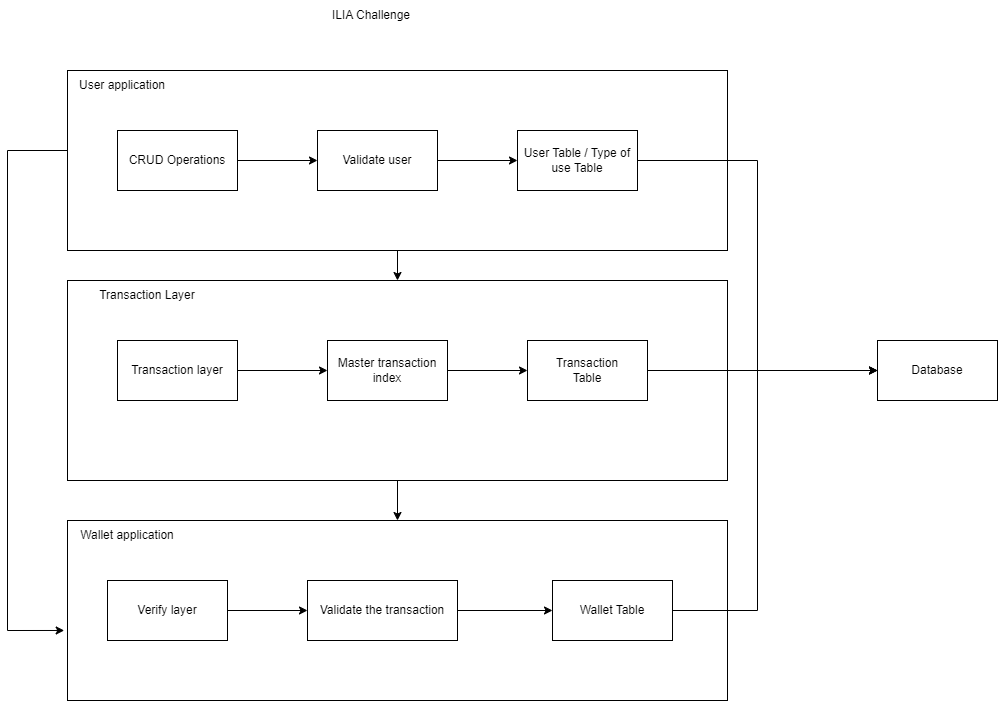
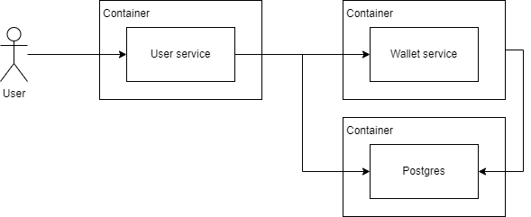

# Ilia-Challenge

## Description
This small project is for the developer opportunity at Ilia.
A powerful and scalable Node.js web application built with Nest.js, TypeORM, TypeScript, Jest, SuperTest, Swagger, UUID, pg, JSON Web Token (jsonwebtoken), class-validator, class-transformer, bcryptjs, platform-express, and Prettier.

## Features

- **User Feature :** An user service, to administrate the user of your financial application(Ilia).
- **Wallet Feature :** A wallet to store the funds of your clients.

## Table of Contents

1. [Running](#installation)

## Some informations about the project
##### Basic Arch of the project



##### Basic Arch of the project


## Run the project 
##### User
- ``` cd user ```
- ``` rename ".env.example to .env" ```
- ``` docker compose up ```
##### Wallet
- ``` cd wallet ```
- ``` rename ".env.example to .env" ```
- ``` docker compose up ```

## Observation

##### On start of the services, will show all the docs in Insomnia and Postman for all routes and your parameters


